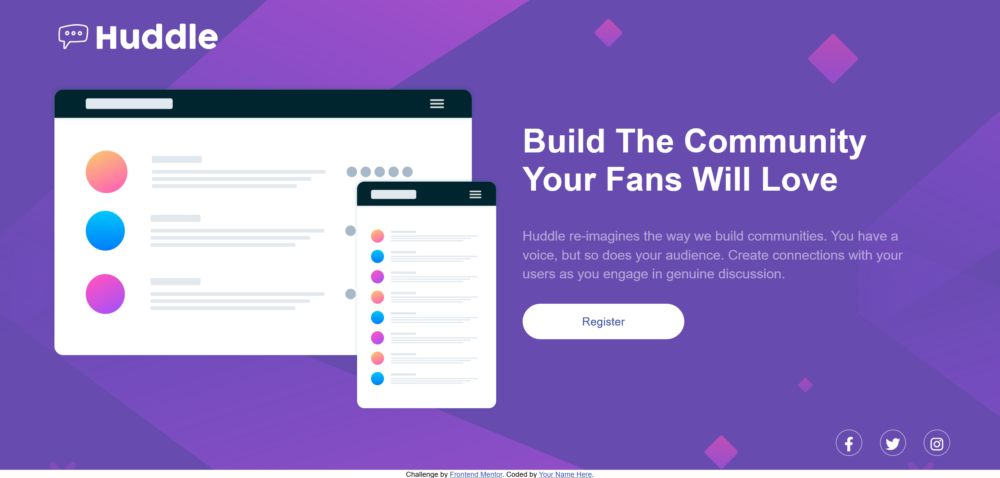

# Frontend Mentor - Huddle landing page with single introductory section solution

This is a solution to the [Huddle landing page with single introductory section challenge on Frontend Mentor](https://www.frontendmentor.io/challenges/huddle-landing-page-with-a-single-introductory-section-B_2Wvxgi0). Frontend Mentor challenges help you improve your coding skills by building realistic projects. 

## Table of contents

- [Overview](#overview)
  - [The challenge](#the-challenge)
  - [Screenshot](#screenshot)
  - [Links](#links)
- [My process](#my-process)
  - [Built with](#built-with)
  - [What I learned](#what-i-learned)
  - [Continued development](#continued-development)
  - [Useful resources](#useful-resources)
- [Author](#author)
- [Acknowledgments](#acknowledgments)

## Overview

### The challenge

Users should be able to:

- View the optimal layout for the page depending on their device's screen size
- See hover states for all interactive elements on the page

### Screenshot


 - Screenshot of the project

### Links

- Live Site URL: [Live Server URL](https://your-live-site-url.com)

## My process

### Built with

- Semantic HTML5 markup
- CSS custom properties
- Flexbox
- CSS Grid
- Mobile-first workflow

### What I learned

I have learned how to make simple templates using HTML and CSS with help of flex properties and grid properties .

Observe below code for given project.

```html
<!DOCTYPE html>
<html lang="en">

<head>
    <meta charset="UTF-8">
    <meta name="viewport" content="width=device-width, initial-scale=1.0">
    <link rel="icon" type="image/png" sizes="32x32" href="./images/favicon-32x32.png">
    <link rel="stylesheet" href="style.css">
    <link rel="stylesheet" href="https://cdnjs.cloudflare.com/ajax/libs/font-awesome/6.4.0/css/all.min.css"
        integrity="sha512-iecdLmaskl7CVkqkXNQ/ZH/XLlvWZOJyj7Yy7tcenmpD1ypASozpmT/E0iPtmFIB46ZmdtAc9eNBvH0H/ZpiBw=="
        crossorigin="anonymous" referrerpolicy="no-referrer" />
    <title>Frontend Mentor | Huddle landing page with single introductory section</title>
</head>

<body>

    <div id="wrapper">
        <div class="container">
            <div class="head">
                
            </div>
            <div class="content">
                <div class="left">
                    
                </div>
                <div class="right">
                    <div class="main">
                        <div class="heading">
                            <h1>
                                Build The Community Your Fans Will Love
                            </h1>
                        </div>
                        <div class="para">
                            <p>
                                Huddle re-imagines the way we build communities. You have a voice, but so does your
                                audience.
                                Create connections with your users as you engage in genuine discussion.
                            </p>
                        </div>
                        <div class="button">
                            <button>Register</button>
                        </div>
                    </div>
                </div>
            </div>
            <div class="foot">
                <div class="icon1">
                    <i class="fa-brands fa-facebook-f icon"></i>
                    <i class="fa-brands fa-twitter icon"></i>
                    <i class="fa-brands fa-instagram icon"></i>
                </div>
            </div>
        </div>
    </div>

    <footer>
        <p class="attribution">
            Challenge by <a href="https://www.frontendmentor.io?ref=challenge" target="_blank">Frontend Mentor</a>.
            Coded by <a href="#">Prasanna</a>.
        </p>
    </footer>

    <script src="https://cdn.jsdelivr.net/npm/typed.js@2.0.12"></script>
    <script src="https://kit.fontawesome.com/a076d05399.js" crossorigin="anonymous"></script>
</body>

</html>
```
```css
/* Heading */
@import url(https://fonts.google.com/specimen/Poppins);
/* Body */
@import url(https://fonts.google.com/specimen/Open+Sans);

* {
    margin: 0;
    padding: 0;
    box-sizing: border-box;
    font-family: "Poppins", sans-serif;
}

#wrapper {
    height: 100vh;
    width: 100%;
    background-color: hsl(257, 40%, 49%);
    background-image: url(images/bg-desktop.svg);
    display: flex;
    justify-content: center;
    align-items: center;
    overflow-x: hidden;
    overflow-y: scroll;
}

.container {
    height: 90%;
    width: 90%;
}

.head {
    height: 10%;
    width: 100%;
}

.content {
    height: 80%;
    width: 100%;
    display: grid;
    grid-template-columns: 50% 50%;
    grid-template-rows: 100%;
    margin-top: 2%;
}

.left {
    width: 100%;
    height: 100%;
    display: flex;
    align-items: center;
}

.left img {
    width: 100%;
    height: 95%;
}

.right {
    width: 100%;
    height: 100%;
    display: flex;
    justify-content: center;
    align-items: center;
}

.main {
    width: 90%;
    height: 90%;
}

.heading {
    font-family: "Poppins", sans-serif;
    font-weight: 400;
    margin-top: 7%;
    font-size: 160%;
    color: white;
}

.para {
    font-family: "Open Sans", sans-serif;
    font-weight: 400;
    margin-top: 7%;
    color: white;
    opacity: 50%;
    font-size: 130%;
    line-height: 140%;
}

.button {
    margin-top: 5%;
}

button {
    font-family: "Poppins", sans-serif;
    font-weight: lighter;
    border: none;
    font-size: 110%;
    border-radius: 50px;
    width: 40%;
    height: 55px;
    color: hsl(228, 45%, 44%);
    background-color: white;
    cursor: pointer;
}

button:hover {
    background-color: hsl(300, 69%, 71%);
    color: white;
    box-shadow: 10px 10px 20px #1f1f1f;
}

.foot {
    height: 10%;
    width: 100%;
}

.icon1 {
    margin-top: 1%;
    display: flex;
    justify-content: flex-end;
    gap: 2%;
    cursor: pointer;
    text-align: center;
    color: white;
    font-size: 140%;
    transition: all 0.4s;
}

.icon {
    width: 40px;
    height: 40px;
    border: 1px solid white;
    border-radius: 50px;
    padding-top: 10px;
}


.icon:hover {
    color: hsl(300, 69%, 71%);
    border: 1px solid hsl(300, 69%, 71%);
}

.attribution {
    font-size: 11px;
    text-align: center;
}

.attribution a {
    color: hsl(228, 45%, 44%);
    text-decoration: none;
}

@media screen and (width<=526px) {
    #wrapper {
        display: flex;
        flex-direction: column;
        justify-content: center;
        align-items: center;
        min-width: 375px;
        height: 100%;
        padding-left: 15px;
        padding-right: 15px;
        padding-top: 50px;
        padding-bottom: 50px;
        background-image: url(images/bg-mobile.svg);
        background-repeat: no-repeat;
        background-size: 100%;
    }

    .container {
        height: 90%;
        width: 90%;
    }

    .head {
        height: 10%;
        width: 100%;
    }

    .head img {
        width: 40%;
        height: 50%;
    }

    .content {
        height: 80%;
        width: 100%;
        display: grid;
        grid-template-columns: 100%;
        grid-template-rows: 50% 50%;
        margin-top: 10%;
    }

    .left {
        width: 100%;
        height: 100%;
        display: flex;
        align-items: center;
    }

    .left img {
        width: 100%;
        height: 95%;
    }

    .right {
        width: 100%;
        height: 100%;
        display: flex;
        justify-content: center;
        align-items: center;
    }

    .main {
        width: 90%;
        height: 90%;
    }

    .heading {
        font-family: "Poppins", sans-serif;
        font-weight: 400;
        margin-top: 7%;
        font-size: 80%;
        text-align: center;
        color: white;
    }

    .para {
        font-family: "Open Sans", sans-serif;
        font-weight: 400;
        margin-top: 7%;
        color: white;
        opacity: 50%;
        font-size: 100%;
        text-align: center;
        line-height: 140%;
    }

    .button {
        margin-top: 15%;
        margin-bottom: 5%;
        display: flex;
        justify-content: center;
    }

    button {
        font-family: "Poppins", sans-serif;
        font-weight: lighter;
        border: none;
        font-size: 110%;
        border-radius: 50px;
        width: 80%;
        height: 45px;
        color: hsl(228, 45%, 44%);
        background-color: white;
        cursor: pointer;
    }

    button:hover {
        background-color: hsl(300, 69%, 71%);
        color: white;
        box-shadow: 10px 10px 20px #1f1f1f;
    }

    .foot {
        height: 10%;
        width: 100%;
    }

    .icon1 {
        margin-top: 45%;
        display: flex;
        justify-content: center;
        gap: 5%;
        cursor: pointer;
        text-align: center;
        color: white;
        font-size: 140%;
        transition: all 0.4s;
    }

    .icon {
        width: 40px;
        height: 40px;
        border: 1px solid white;
        border-radius: 50px;
        padding-top: 10px;
    }


    .icon:hover {
        color: hsl(300, 69%, 71%);
        border: 1px solid hsl(300, 69%, 71%);
    }


    .attribution {
        text-align: center;
        font-size: 9px;
    }
}

@media screen and (width<=375px) {

    #wrapper {
        display: flex;
        flex-direction: column;
        justify-content: center;
        align-items: center;
        height: 100%;
        padding-left: 15px;
        padding-right: 15px;
        padding-top: 50px;
        padding-bottom: 50px;
        background-image: url(images/bg-mobile.svg);
        background-repeat: no-repeat;
        background-size: 100%;
    }

    .container {
        height: 90%;
        width: 90%;
    }

    .head {
        height: 10%;
        width: 100%;
    }

    .head img {
        width: 40%;
        height: 50%;
    }

    .content {
        height: 80%;
        width: 100%;
        display: grid;
        grid-template-columns: 100%;
        grid-template-rows: 50% 50%;
        margin-top: 10%;
    }

    .left {
        width: 100%;
        height: 100%;
        display: flex;
        align-items: center;
    }

    .left img {
        width: 100%;
        height: 95%;
    }

    .right {
        width: 100%;
        height: 100%;
        display: flex;
        justify-content: center;
        align-items: center;
    }

    .main {
        width: 90%;
        height: 90%;
    }

    .heading {
        font-family: "Poppins", sans-serif;
        font-weight: 400;
        margin-top: 7%;
        font-size: 80%;
        text-align: center;
        color: white;
    }

    .para {
        font-family: "Open Sans", sans-serif;
        font-weight: 400;
        margin-top: 7%;
        color: white;
        opacity: 50%;
        font-size: 100%;
        text-align: center;
        line-height: 140%;
    }

    .button {
        margin-top: 15%;
        margin-bottom: 5%;
        display: flex;
        justify-content: center;
    }

    button {
        font-family: "Poppins", sans-serif;
        font-weight: lighter;
        border: none;
        font-size: 110%;
        border-radius: 50px;
        width: 80%;
        height: 45px;
        color: hsl(228, 45%, 44%);
        background-color: white;
        cursor: pointer;
    }

    button:hover {
        background-color: hsl(300, 69%, 71%);
        color: white;
        box-shadow: 10px 10px 20px #1f1f1f;
    }

    .foot {
        height: 10%;
        width: 100%;
    }

    .icon1 {
        margin-top: 45%;
        display: flex;
        justify-content: center;
        gap: 5%;
        cursor: pointer;
        text-align: center;
        color: white;
        font-size: 140%;
        transition: all 0.4s;
    }

    .icon {
        width: 40px;
        height: 40px;
        border: 1px solid white;
        border-radius: 50px;
        padding-top: 10px;
    }


    .icon:hover {
        color: hsl(300, 69%, 71%);
        border: 1px solid hsl(300, 69%, 71%);
    }

    .attribution {
        text-align: center;
        font-size: 4px;
    }

}
```

### Continued development

I am trying to improve my skills in media queries.

### Useful resources

- [MDN Docs](https://developer.mozilla.org/en-US/) - Helped me in various learnings. 

## Author

- Website - [Prasanna Pandhare](https://www.your-site.com)
- Frontend Mentor - [@Prasannapandhare](https://www.frontendmentor.io/profile/Prasannapandhare)

## Acknowledgments

I understood the importance of CSS in designing HTML structure.
As well as understood about responsive websites.